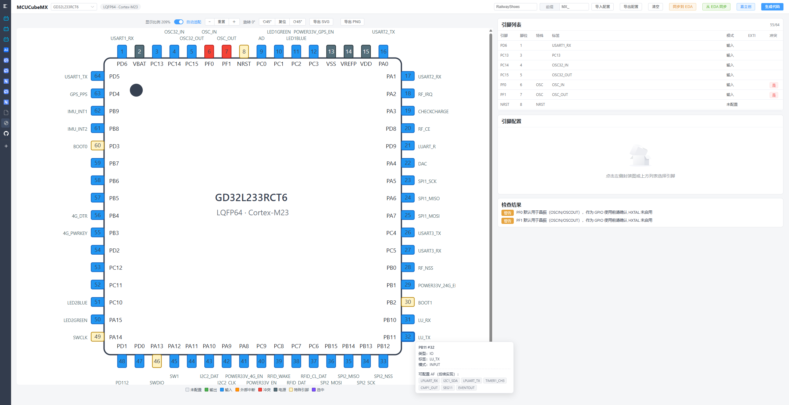

# MCUCubeMX — GD32 引脚配置与代码生成工具

一个纯本地 Web 应用：数据驱动渲染 LQFP 封装图，点击引脚配置 GPIO/EXTI，实时冲突检查，
一键生成并下载可编译的 `gpio.h` / `gpio.c` / EXTI 中断文件；并可与**嘉立创 EDA Pro 专业版**
实时双向同步引脚配置。

当前支持的器件：

- **GD32L233RCT6**：LQFP64、256KB Flash、32KB SRAM、Cortex-M23 @64MHz（GD32L23x 标准外设库）
- **GD32F427VE**：LQFP100、512KB Flash、256KB SRAM、Cortex-M4 @200MHz（GD32F4xx 标准外设库）

## 效果图



## 功能特性

### 封装图

- 数据驱动程序化生成，按状态着色（未配置/输出/输入/复用(AF)/模拟/EXTI/冲突/电源/特殊）
- GPIO 名显示在芯片内部，配置标签显示在引脚外侧（不截断），上下侧标签交错防重叠，四角引脚向内让位
- **45° 步进旋转**（旋转时文字保持水平可读），自动适配旋转后的实际占用空间
- **悬停显示引脚详情**：类型/别名/当前配置（模式、功能、输出参数、上下拉、EXTI）与所属分组
- Pin 1 方向标记圆点；支持**导出 SVG / PNG**
- 点击引脚选中并联动右侧配置面板

### 引脚配置与冲突检查

- 输出：推挽/开漏、速度档位、初始电平；输入：上下拉、EXTI 边沿（上升/下降/双边沿）
- **AF 复用 / 模拟输入输出**：选择复用信号（互斥，防重复分配）或 ADC/DAC 模拟通道
- 标签命名 + 分组宏定义；配置工程文件（JSON）导入/导出
- 冲突检查：特殊引脚保护（NRST/BOOT/SWD 需显式解锁）、EXTI 线冲突、AF/模拟信号重复、电源引脚拦截、重复标签
- 右侧栏「外设使用情况」：按外设归并展示信号与引脚（USART1: TX=PA10…）、EXTI、通用 GPIO
- 右侧栏「外设配置」：USART/ADC 实例配置面板（由 AF/模拟引脚自动归并实例），
  支持波特率/字长/停止位/校验/流控/时钟源，以及 ADC 分辨率/对齐/采样时间/触发源/通道列表
- 右侧栏「中断线分配」：16 条 EXTI 线全量列表（EXTI0~4 / EXTI5_9 / EXTI10_15 分组），
  显示已分配引脚、标签、触发边沿与空闲状态
- 右侧栏「ADC 通道分配」：全部 ADC 通道（ADC_IN0~IN15）逐条显示，下拉选择可分配引脚，
  已使用/未使用颜色区分；选择已占用引脚时弹窗确认，确认后覆盖原配置并支持撤回；
  下方另列**内部通道**（温度 TEMP / 基准 VREF / VBAT / VSLCD，仅显示）
- 右侧栏「中断线分配」：16 条 EXTI 线同样支持下拉分配引脚、触发边沿选择、
  占用确认覆盖与撤回；下方另列**全部 NVIC 内部中断**（TIMER/USART/DMA/ADC/SysTick 等，仅显示）
- 右侧栏「引脚分组」：按模块自定义分组（单归属、自动配色），封装图按组描边

### 时钟树配置

- 顶栏「GPIO / 时钟」按钮**切换整个工作区**：GPIO 模式为封装图 + 右侧引脚面板；
  时钟模式为全屏**图形化 SVG 时钟树**（源 → PLL → SYSCLK → AHB → APB1/APB2 → ADC）
- **三段式统一布局**：固定顶栏 + 左侧 SVG 窗口（占满剩余高度）+ 右侧可滚动配置列表，
  GPIO 与时钟模式共用同一布局与卡片样式
- 时钟树覆盖**完整时钟域**：TIMER 域（APB 分频>1 时 ×2）、RTC/FWDGT（LXTAL/IRC32K）、
  USB 48MHz（IRC48M/PLL，含 48MHz 约束校验）、SysTick=HCLK/8、CK_OUT 标注；
  **PLL 自动解算**：输入目标 SYSCLK 自动枚举合法 PLL 组合并一键应用
- 右侧配置栏目**全部可折叠**（共享 `CollapsiblePanel` 组件，标题栏点击展开/收起）；
  GPIO 模式「引脚配置」置顶显示
- 顶栏「折叠左栏」可整体收起左侧 SVG 窗口（封装图/时钟树），右侧配置列表占满整行；
  再次点击展开并保留旋转/缩放状态
- 时钟树支持 **45° 步进旋转**（文字保持水平可读）、**自动适配窗口**与**滚轮/按钮缩放**，
  右侧编辑区随面板滚动；时钟页与 GPIO 封装图**高度固定填满窗口**（不随内容变化）
- GPIO 封装图与时钟树共用**统一布局与工具条**：标题栏 + 缩放/旋转/导出按钮（共享
  `ViewToolbar` 组件）+ 舞台 + 底部栏；时钟树同样支持导出 SVG / PNG
- 连线使用**平滑贝塞尔曲线**与箭头，分频标签（÷2 / ×N）加粗加白描边，红色链路自动切换红色箭头
- APB1/APB2/ADC 节点下方直接**显示挂载外设标签**（自动换行，悬停/点击可聚焦对应配置区）
- 点击节点编辑对应参数（时钟源选择、HXTAL 频率、PLL 倍频/分频、总线分频、ADC 时钟），非法项红色高亮
- 实时计算频率链并逐项校验：HXTAL 范围、PLL 输入/VCO/输出上限、SYSCLK/AHB/APB1/APB2/ADC 上限与分频档位
- **外设挂载标注**：AHB/APB1/APB2/ADC 节点显示挂载外设数量，右侧编辑区列出完整清单
  （如 APB1: TIMER1/2/5/6/11、SPI1、USART1、I2C0/1/2、LPUART…），SVG 悬停可见全部外设
- **可选时钟源标注**：右侧「可选时钟源的外设」面板列出可切换时钟的外设及其选项
  （如 USART0 → APB2/SYSCLK/LXTAL/IRC16MDIV、ADC → APB2/AHB/IRC16M、
  USBD → IRC48M/PLL、RTC → LXTAL/IRC32K/HXTAL32），未列出的外设跟随所在总线时钟
- 数据驱动（`clock.json`）：新增器件只需补一份时钟规格即可获得完整界面与代码生成

### 代码生成

- EJS 模板生成 `gpio.h`（分组宏定义）、`gpio.c`（`MX_GPIO_Init` / `MX_EXTI_Init`，
  含复用 `gpio_af_set` 与模拟 `GPIO_MODE_ANALOG` 初始化段）、
  `clock.h/clock.c`（`MX_Clock_Init`：振荡器使能、PLL 配置、AHB/APB1/APB2/ADC 分频、
   SYSCLK 源选择；F427 顺带 NVIC 优先级分组与 200MHz 高压驱动模式）、
  `usart.h/c`（`MX_USARTx_Init`：波特率/字长/停止位/校验/流控/时钟源）与
  `adc.h/c`（`MX_ADCx_Init`：分辨率/对齐/通道/采样/触发，L23x 单 ADC 与 F4xx ADCx 自动适配 API）、
  `app_it.c`（EXTI 中断骨架，带 USER CODE 区段）、`project.json`、`README.md`，打包 ZIP 下载
- 生成内容**可按子项选择**：引脚定义（gpio.h）/ 引脚初始化（gpio.c+app_it.c）/
  时钟定义（clock.h）/ 时钟初始化（clock.c）/ 外设初始化（usart、adc），
  预览与 ZIP 只包含勾选的文件，README 同步按选择说明
- 按器件的固件档案自动适配（头文件、速度档位、NVIC 优先级分组、EXTI 边沿枚举）
- 生成独立 `clock.c`（不改动固件库 system 文件），旧工程配置无时钟字段时自动使用器件默认时钟
- 本地 `arm-none-eabi-gcc` + 官方固件库编译验证生成代码

### 嘉立创 EDA Pro 对接

- 顶栏按钮：**同步到 EDA**、**从 EDA 同步**、**嘉立创**（完整面板）
- 官方 WebSocket 桥（`run-api-gateway` 扩展 + `bridge-server.mjs`），`npm run dev` 自动拉起
- 读取：当前工程/板/原理图子页、MCU 器件识别（鼠标选中优先）、引脚→网络映射（端口/线段识别）
- 导入：对比变更（新增/修改/不变/移除）后写入工程配置
- 同步：**四种模式**——线段模式（改网络名）/ 端口模式（新增/更新端口）/ 转化为网络端口（删线段放端口）/ 转化为线段（删端口放线段）
- 同步时把引脚配置属性（`PAx_MODE/LABEL/PULL/EXTI/OTYPE/SPEED/LEVEL`）写入 MCU 元件本身
- 记住所选 MCU，打开面板自动恢复，**一键同步**（可勾选“同步免确认”）
- 失败时控制台输出详细日志（`[JLC]` 前缀）

详细对接说明见 [scripts/jlc/README.md](scripts/jlc/README.md)。

## 快速开始

```bash
npm install
npm run dev        # http://localhost:5173
```

**嘉立创对接（可选）**：在嘉立创 EDA Pro 安装 `run-api-gateway` 扩展并勾选“允许外部交互”；
开发模式下 `npm run dev` 会自动启动本地桥，也可以在面板顶部一键复制 `npm run dev:all` 命令。

## 开发命令

| 命令 | 说明 |
| --- | --- |
| `npm run dev` | 启动开发服务器（自动拉起嘉立创本地桥） |
| `npm run dev:all` | 同时启动 Vite + 嘉立创桥 |
| `npm run jlc:bridge` | 仅启动嘉立创本地桥 |
| `npm run build` | 类型检查（vue-tsc）+ 生产构建 |
| `npm run test` | 单元/快照/集成测试（Vitest，桥在线时自动跑 EDA 集成用例） |
| `npm run lint` | ESLint |
| `npm run validate:device` | 校验器件数据（引脚完整性、AF 表、EXTI 分组、clock.json 结构） |
| `npm run verify:build` | 用 arm-none-eabi-gcc + GD32 固件库编译验证生成代码 |

## 编译验证

`npm run verify:build` 会调用浏览器端同一套生成逻辑，把样例配置生成到临时目录，再与
对应器件的固件库（CMSIS + 标准外设库）一起用 arm-none-eabi-gcc 完整编译链接。

固件库路径通过环境变量指定（不纳入本仓库，遵守其软件许可）：

```powershell
$env:GD32L23X_FIRMWARE_DIR = "D:\...\GD32L23x_Firmware_Library_V2.4.0\Firmware"
npm run verify:build
```

GD32F427VE 的验证：`$env:GD32F4XX_FIRMWARE_DIR = "D:\...\gd32f4xx"` 后执行
`node scripts/verify-build.mjs --project tests/fixtures/sample-project-f427.json`。
F4xx 编译验证使用仓库自带的 CMSIS 5 内核头（`scripts/firmware/cmsis`，Apache-2.0）
与最小 startup（`scripts/firmware/startup_gd32f427.S`）。

## 器件数据来源

`data/devices/gd32l233rct6/` 下的 JSON 均转录自 **GD32L233xx Datasheet Rev1.9**，每条数据带溯源：

- `package.json`：Table 2-3（GD32L233Rx LQFP64 引脚定义），含 64 引脚、类型、封装边、
  特殊引脚标志、alternate/additional 功能列表
- `af.json`：Table 2-9 ~ 2-13（Port A/B/C/D/F 复用功能表，AF0~AF9），已用官方例程中的
  `gpio_af_set` 调用交叉核对 AF 编号
- `exti.json`：EXTI 线 = 引脚号，中断分组（EXTI0~4 / EXTI5_9 / EXTI10_15）与
  startup_gd32l233.S 向量表一致
- `clock.json`：时钟树规格，转录自 GD32L23x 用户手册 Rev2.4 第 4 章（RCU）——
  IRC16M/IRC48M/HXTAL(4~32MHz)、PLL(×4~×127、输出≤64MHz)、AHB/APB1(≤32MHz)/APB2(≤64MHz)/ADC(≤16MHz)
  分频档位、固件库宏映射与各总线挂载外设清单；GD32F427VE 的 `clock.json` 转录自
  GD32F4xx 用户手册（PLL PSC/N/P/Q、SYSCLK≤200MHz、APB1≤60MHz、APB2≤120MHz、ADC≤40MHz）
- `peripherals.json`：外设实例规格（USART 信号前缀/时钟源映射、ADC 分辨率/采样/触发选项），
  按固件库头文件与用户手册转录
- `interrupts.json`：全部 NVIC 中断向量（由 CMSIS 头文件 IRQn 枚举自动生成，
  可运行 `node scripts/gen-interrupts.mjs` 重新生成）

`scripts/validate-device-data.mjs` 强制执行一致性校验：引脚唯一连续、每边引脚数、
AF 表与引脚定义集合一致、EXTI 分组正确、clock.json 档位/范围/宏映射齐全、peripherals.json 结构合法。

## 架构

```
src/
  data/device.ts          器件数据加载与查询（多器件注册表）
  lib/packageSvg.ts       封装图几何、配色与旋转/导出辅助
  lib/conflicts/          冲突检查规则
  lib/clock/              时钟频率链计算、合法性校验、SVG 树布局
  lib/codegen/            EJS 模板 + 生成器 + ZIP 导出
  lib/jlc/                嘉立创桥客户端、引脚归一化、导入/导出计划、偏好存储
  stores/project.ts       Pinia 状态（配置、解锁、持久化）
  components/             封装图 / 引脚表 / 配置面板 / 时钟树 / 冲突面板 / 生成预览 / 嘉立创对接面板
data/devices/gd32l233rct6/  器件数据（package / af / exti / clock）
scripts/                  validate-device-data / verify-build / build-generated / jlc 桥
tests/                    数据、冲突、代码生成、封装图、JLC 导入/偏好、EDA 集成测试
```

代码生成使用 EJS（`<% %>` 定界符），浏览器端以 `client: true` 编译，不依赖 node 内置模块
（`vite.config.ts` 将 ejs 惰性引用的 fs/path 替换为空 stub，`tests/browserEjs.test.ts` 验证）。

## 路线图

- **Phase 1（已完成）**：引脚配置 + GPIO/EXTI 代码生成 + 编译验证 + 嘉立创 EDA Pro 双向同步
- **Phase 2（已完成）**：图形化时钟树配置（频率链计算 + 合法性校验 + 生成独立 `clock.c/clock.h`，
  已接入 L233/F427 编译验证）；后续可扩展图形化 PLL 自动解算与更多时钟输出（CK_OUT/USBD）
- **Phase 3**：已完成 AF 复用/模拟选择（互斥检查）、外设使用侧边栏、引脚分组、
  **USART/ADC 外设配置与代码生成**（M1/M2，含编译验证）；剩余 SPI/I2C/TIMER 扩展、
  USART/ADC 中断与 DMA 支持
- **Phase 4**：工程级导出（Keil/GCC/Embedded Builder、链接脚本、`main.c` 骨架、多型号支持）
